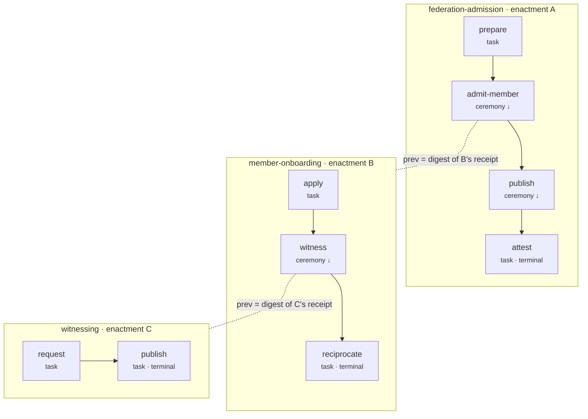
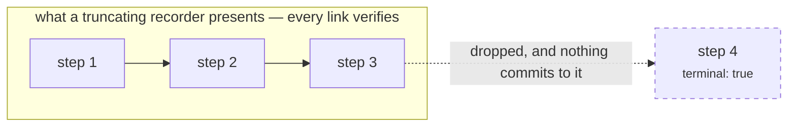
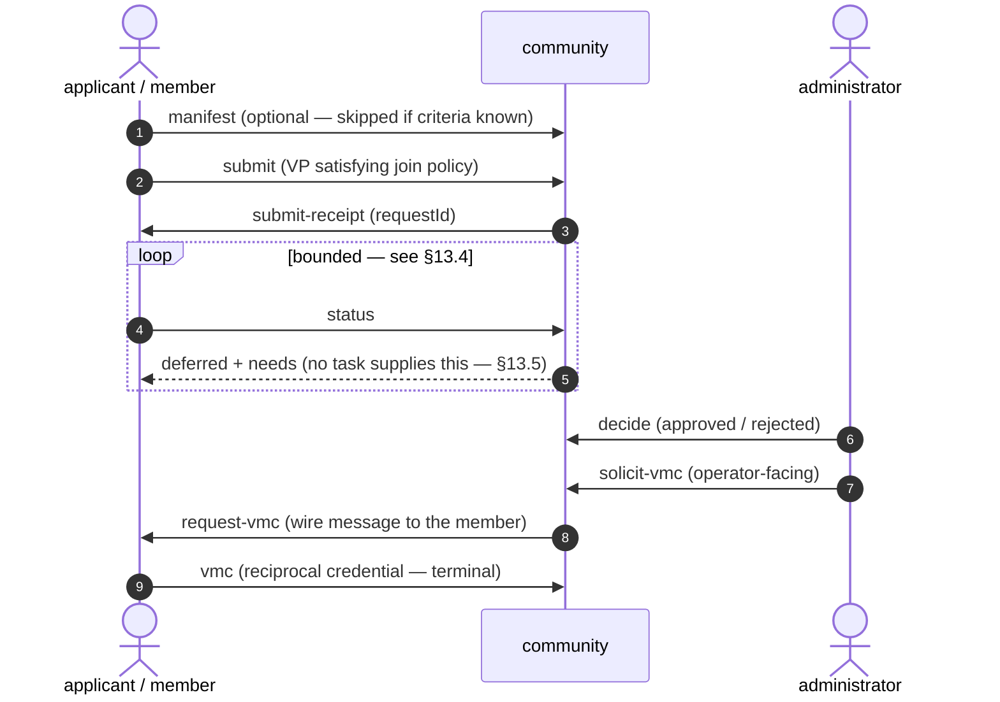
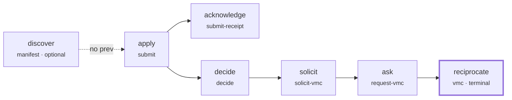

# Design Note: Trust Ceremonies

| | |
|---|---|
| **Status** | Draft — proposed, not implemented |
| **Date** | 2026-08-09 |
| **Applies to** | Any interaction composed of more than one *Trust Task* between two or more parties |
| **Related** | `docs/adr/0001-naming-the-multi-task-flow-layer.md`, SPEC §2, §4.9–§4.9.2, §4.10 item 5, §6.1, §7.3 items 13–14, §8.6, §9.3, §11, `specs/vtc/join-requests/*`, `specs/vtc/members/{solicit-vmc,request-vmc,vmc}/0.1`, `specs/vtc/ceremonies/list/0.1`, `specs/audit/verify/0.1`, `specs/vta/credentials/issue/0.2` |

*This note is non-normative rationale, and takes the six decisions ADR 0001
deferred. Nothing here is published or on the wire: no framework version carries
the `ceremony` envelope member, and no implementation exchanges a ceremony step.*

*Part of it is now built, however, and the note is no longer purely prospective.
The definition format of §6 exists as `ceremonies/ceremony.meta.schema.json`,
with a first definition at `ceremonies/vtc/member-onboarding/0.1/` composed only
of Type URIs the registry already serves, publication checks in
`scripts/validate-ceremonies.mjs`, and 14 conformance fixtures that must be
rejected. Building it corrected the design in four places — recorded in §16.*

*It is written before the implementation rather than after it, which is the
weaker position. §15 is therefore longer than it would be in a retrospective
note, and should be read as part of the proposal rather than as an appendix. A
design note that only records its wins is marketing; a prospective one that only
records its confidence is worse.*

*Revised twice since. An adversarial re-read found four security defects severe
enough to break end-to-end verification; building the definition format found
four modelling defects. All eight are fixed in place in §5–§7, and
**[§16](#16-what-this-note-got-wrong-in-two-rounds) records what they were and
why each round missed what the other found** — including two that were warnings
already written in the specs this design borrows from. Read §16 before relying on
any part of §7.*

*One stage is shipped: `trust-task-next-step/0.1` (§8), the coordination concern,
published independently of everything else here and usable at framework 0.3.*

## 1. Problem

Trust Tasks works where an interaction is one task and one response. Interactions
are now appearing that are not that shape: a governance decision needing several
endorsements, member onboarding spanning a witness and a registry, a credential
exchange with a consent step in the middle.

These are built today as several bilateral tasks correlated by `threadId`. That
part is right, and SPEC §2 already settles it:

> Exchanges involving more than two parties are modeled as multiple bilateral
> *Trust Tasks* linked by the framework's `threadId` member.

What is wrong is where the *composition* lives. Today it is in application code
at each party: which task follows which, who may perform each step, and what it
means for the whole thing to have completed. Three consequences follow.

- **It cannot be published.** A community cannot hand a counterparty a machine-
  readable description of an onboarding flow, so every integration is pairwise
  again — the exact problem §1 of SPEC set out to remove, displaced one level up.
- **It cannot be reviewed.** A governance body approving "how members are
  admitted" is approving prose plus somebody's implementation.
- **It cannot be proven.** Each step's document proves that step. Nothing proves
  the flow: not that these steps belong together, not that no step was dropped,
  not that it finished.

The third is the one that motivates the layer. The rest is convenience.

## 2. Three concerns, deliberately separable

"Orchestration" conflates three things with different design pressures. Keeping
them separate is the single most important structural decision here.

| | Concern | Nature | Status today |
|---|---|---|---|
| **1** | **Definition** — which tasks, which roles, what order | Static, published, auditable | Nothing (VTC has a local analogue) |
| **2** | **Coordination** — who drives, how a party learns what is next | Dynamic, per-run | `threadId`, plus `trust-task-next-step/0.1` (§8) |
| **3** | **Evidence** — what proves the *whole* flow happened | Artifact, retained | Nothing |

They must remain independently adoptable. A ceremony should be usable
**definition-only** — a community publishes the script, humans and existing task
implementations follow it, nothing new on the wire — and **evidence-only** — an
ad-hoc flow that nonetheless yields a receipt. If (1) is a precondition for (3),
adoption stalls behind a definition format nobody has written yet.

### 2.1 Ceremonies are optional, in both directions

Nothing in this layer is mandatory for a *Trust Task*, and the optionality is
worth stating precisely because it is load-bearing on adoption. Four separate
claims:

**1. No Trust Task specification changes, ever.** A specification declares
nothing about ceremonies and needs no awareness of them. The `ceremony` member
lives on the envelope, not in `payload` (§5.2), so *any* existing task can be a
ceremony step with no schema edit, no new version, and no republished library.
That is not a convenience — it is the reason the member cannot live in `payload`,
since composing tasks whose authors never anticipated the flow is the entire
point.

**2. A document without `ceremony` is fully conforming**, exactly as one without
`threadId` is. The member is optional under §4.2, and a task used outside any
flow is unaffected by this layer's existence.

**3. A consumer need never implement ceremonies at all.** A ceremony step
arriving at a ceremony-unaware consumer is simply a Trust Task: §7.2's rule to
preserve but not act upon unrecognized members applies, the §7.2 pipeline runs
unchanged, and the task executes correctly.

  **Ignoring the member is always safe**, and that is a consequence of §10 rather
  than luck: because a consumer **MUST NOT** derive authority from ceremony
  membership, there is nothing a ceremony-aware consumer is permitted to do that
  an unaware one omits. Every authorization decision still rests on `issuer`,
  `proof`, and local policy. A layer whose neglect changed an access decision
  would be a security defect.

  The asymmetry is therefore: **producers opt in per document; consumers never
  have to.**

**4. Even within a ceremony, the definition is optional.** `collected` and
`chained` evidence need no published definition (§7.6) — the steps carry
`enactment` and `prev`, and a verifier checks what it holds. Only `receipt` and
`countersigned` require one, because only they make claims about the flow as a
whole.

One consequence worth noting for sequencing: the framework 0.3 envelope schema
sets `additionalProperties: true`, and §4.2 permits additional top-level members.
A document carrying `ceremony` therefore **already validates** against today's
framework. What 0.4 adds is the *meaning* of the member and the obligations that
attach to it — not permission to send it.

## 3. What already exists

Most of the mechanism is present and was never named as a layer.

| Piece | Status | Gives | Gap |
|---|---|---|---|
| `threadId` (§4.9) | Normative; no validation semantics | One exchange | Not unique, not enforceable |
| `parentThreadId` (§4.9.2) | Navigation only | One level of containment | §5.1 |
| §4.9.1 | Normative | How to cite an exchange as evidence | Only names one exchange |
| `trust-task-next-step` (§8.6) | **Published 0.1** | Recipient-driven continuation | §8 |
| `trust-task-ok` (§8.6) | **Reserved, unspecified** | Success with receipt | — |
| `sideEffects` / `exposure` (§7.3.13–14) | Normative, per task | Risk class per step | Does not aggregate — §11 |
| `audit` hash chain | Shipped | Tamper-evidence pattern | Single-party, single log |
| `trust-task-discovery` (§11) | Shipped | "Which tasks do you accept?" | Not "which ceremonies, in which role?" |

§4.9.2 also concedes the gap in writing, which is worth quoting because it
scopes this note:

> The member records **one** level of containment. Reconstructing a deeper
> ancestry requires the intervening documents, and the framework defines no
> representation for a full chain; a specification needing one is better served
> by an explicit payload structure than by inferring it from thread metadata.

This layer is that explicit structure.

## 4. Vocabulary

Fixed by ADR 0001; restated so this note stands alone.

| Term | Names | Analogous to |
|---|---|---|
| **Ceremony** | The definition — published, versioned, resolvable | A *Trust Task specification* |
| **Enactment** | One run of a ceremony; globally unique, non-reusable | A *Trust Task document* |
| **Step** | One *Trust Task* exchange within an enactment | — |
| **Ceremony receipt** | The evidence artifact for a completed enactment | — |
| **Recorder** | The role a definition names as issuer of the receipt | — |

ADR §5 leaves open whether the definition is instead called a *choreography*.
This note spells the envelope member `ceremony` throughout; if the split
vocabulary is adopted, the member is `choreography` and every occurrence changes
with it. That substitution is the whole of the difference, which is itself an
argument that the sub-decision can be settled late — but not after 0.4 (§13).

## 5. Threading

Proposed: one new top-level member, added in framework 0.4.

```json
{
  "id": "urn:uuid:2c7f5e10-6a4b-4f8e-9d31-0b6a2f4c8e15",
  "type": "https://trusttasks.org/spec/webvh/witness/publish/0.1",
  "threadId": "urn:uuid:4a0e2b77-88c1-4d55-9f2a-6c3d1e5b7a92",
  "parentThreadId": "9b1d3f60-52a8-4c17-8e44-1d9c7b05f3ae",
  "ceremony": {
    "definition": "https://trusttasks.org/ceremony/vtc/member-onboarding/0.1",
    "definitionDigest": "zQmb1XVvHqbCe5nUPFxpJcRz3RtP4pQyKgTsWJgNBzVhE7d",
    "enactment": "urn:uuid:8f21b0c4-7d3e-4a91-b5c2-1e6f0a9d4b83",
    "parentEnactment": "urn:uuid:3e77a941-05bc-4c62-8d19-fa2b6e0c7d54",
    "step": "witness-publish",
    "round": 1,
    "prev": [
      { "id": "urn:uuid:1d0a…", "digestMultibase": "zQmb…" },
      { "id": "urn:uuid:7c42…", "digestMultibase": "zQmW…" }
    ]
  },
  "issuer": "did:web:witness.example",
  "recipient": "did:web:host.example",
  "issuedAt": "2026-08-08T10:15:00Z",
  "payload": { "…": "…" }
}
```

An object rather than a bare `ceremonyId` string, because a bare string needs
siblings within a week: a verifier that knows only "these documents share an
identifier" cannot check the set against anything.

`prev` is a **set** of digests, not one. It degenerates to a chain when steps are
sequential and expresses a partial order when they are not — two endorsements
gathered concurrently, both named by the step that consumes them. A linear-only
`prev` would force definitions to serialize work that is genuinely parallel, and
serialized-for-the-format is the kind of lie that makes evidence wrong later.

`enactment` MUST be globally unique and non-reusable, on the same terms as `id`
(§4.3) and unlike `threadId`. It is what §4.9.1 citations name when the claim is
about the flow rather than about one exchange.

`definitionDigest` pins the definition **by content, not by name**. Without it
the whole evidence model is rooted in a mutable URI: whoever controls
`trusttasks.org/ceremony/…` controls the completion rule, the role list, and the
declared evidence level — retroactively, for every enactment ever run — and a
verifier checking a two-year-old receipt resolves whatever is served today. The
digest is a multibase-multihash over the JCS canonicalization of the definition
(§7.7) and is signed with the rest of the envelope, so a step commits to the
exact rules it was enacted under. It also disposes of the
definition-revised-mid-enactment problem, which is this defect in another guise:
steps pinning different digests are, correctly, steps of different ceremonies.

`round` distinguishes repetitions of the same step under the bounded-repetition
rule (§13.4). Without it, round 2's document and round 3's are the same step name
between the same parties under the same type, and one replays as the other.
Absent means round 1. It is signed, like everything else here.

`parentEnactment` names the enactment this one is a step of, and takes exactly
the posture §4.9.2 gives `parentThreadId`: one level, navigation only, no
rejection on it alone, and never equal to this document's own `enactment`. One
level is not a depth limit — it is a linked list, and §6.5 shows why that reaches
arbitrary depth where `parentThreadId` could not.

### 5.3 What `threadId` still does

Four identifiers on one envelope needs a rule, or producers will guess. Within a
ceremony: `threadId` scopes **one step's** request/response exchange, exactly as
it does outside a ceremony; `enactment` scopes the flow across all steps. They
are not alternatives and a producer sets both. A step that is a request/response
pair has one `threadId` for that pair and shares `enactment` with every sibling
step, which is why §5.1's "membership is not containment" matters — the steps are
siblings, not nested exchanges.

### 5.1 Why not `parentThreadId`

The obvious objection is that this already exists: model the ceremony as an
enclosing exchange and let each step set `parentThreadId` to its thread. It is
close, and it fails on three counts.

1. **It carries no normative semantics.** §4.9.2 states a consumer `MUST NOT`
   reject a document on the basis of `parentThreadId` alone. Ceremony membership
   needs to be checkable — "this is not the step I am at", "this predecessor
   digest does not match". Adding that would break the member's stated contract
   for every existing user of it.
2. **It records one level, and ceremonies nest.** §4.9.1's own worked example is
   a witnessing ceremony conducted inside a relationship exchange. Spend
   `parentThreadId` on ceremony membership and the nesting it was added for can
   no longer be expressed.
3. **It points at a `threadId`,** which §4.9 does not require to be unique or
   non-reusable. Evidence needs a stable anchor. §4.9.1 hit exactly this and
   mandated naming by document `id` instead; the same reasoning applies here.

There is also a modelling mismatch. Membership is not containment: an
enactment's steps are typically *siblings* — several top-level exchanges, none
nested inside another. That is a flat set, not a tree edge.

The four identifiers are orthogonal and should stay that way:

| Member | Names | Unique? | Enforceable? |
|---|---|:--:|:--:|
| `id` | One document | Yes (§4.3) | Yes |
| `threadId` | One exchange | No | No (§4.9) |
| `ceremony.enactment` | One flow | Yes | Yes |
| `parentThreadId` | Nesting between exchanges | n/a | No (§4.9.2) |

### 5.2 Why it must be a top-level member

It cannot live in `payload`: every task schema would have to opt in, and a
ceremony composed of tasks whose authors never anticipated it would be
impossible. That defeats the purpose — the point is to compose *existing* tasks.

It cannot live in `ext`: §4.5.1 requires reverse-DNS namespacing and item 6
forbids cross-specification semantics for any `ext` key. A *standard* ceremony
could not exist under those rules, only vendor ones.

§4.2 already permits additional top-level members, so this is a framework minor
bump and not a breaking change to the document model. It is, however, a breaking
change to the *libraries* — see §13.

There is a security reason as well, and it is the stronger one. A Data Integrity
proof covers the document with `proof` excluded (§4.7), so a top-level `ceremony`
member is **signed**. Both `enactment` and `definition` are therefore bound to
the step by its issuer. Carried as transport metadata or as an unsigned sidecar,
a step could be lifted into a different enactment, or reinterpreted under a
different definition that gives its `step` name another meaning. §10 develops
this.

## 6. The definition

A ceremony definition is a published document at
`https://trusttasks.org/ceremony/<slug>/<MAJOR.MINOR>`, versioned on the §5
scheme, resolvable under content negotiation like a *Type URI*.

### 6.1 Contents

*Now implemented as `ceremonies/ceremony.meta.schema.json`; this section is the
rationale for what that schema constrains.*

- **Roles** — named participants (`witness`, `registry`, `applicant`), with the
  VID schemes each accepts, bound to actual VIDs at enactment rather than here.
  Each carries a **cardinality**: `one`, or `many` for a role that binds to a
  *set* — a witness set, an approver set. Without `many`, M-of-N is
  inexpressible, because the approvers in a `task-consent` flow are not known
  when the definition is written.

  A role may also be **evidentiary** — see §6.1.1, which is the least obvious
  thing in this section.
- **Steps** — each with a stable `step` name, what it enacts, the role that
  issues it, the role that receives it, whether it is required or optional, its
  `prev` step names, and its **multiplicity**: `single`, or `perRole` for one
  instance per VID bound to the issuing role. `perRole` is fan-out — N approvers
  each returning one decision, a witness set each signing — and it is distinct
  from `maxRounds`: **multiplicity varies the party, repetition varies the
  attempt.** Instances are discriminated on the wire by the document's `issuer`,
  which is signed, so no additional envelope field is needed and one
  participant's instance cannot be replayed as another's.
- **Evidence level** — one of §7's four, plus the roles permitted to record
  (§7.4).
- **Completion** — which steps must have occurred for the enactment to be
  complete. Not necessarily "all of them": a definition with optional steps needs
  to say what suffices, and thresholds are the ordinary currency of the
  governance domain this layer exists to serve.

  **There are two threshold shapes, and an earlier draft of this note conflated
  them.** `of` is a threshold over **distinct named steps** — three of these five
  endorsements, each its own step. `ofStep` is a threshold over the
  **instances of one `perRole` step** — two of however many witnesses were bound,
  or `task-consent`'s `minApprovals` over N approvers.

  §15 previously cited `task-consent` as evidence for the first shape. It is the
  second: N approvers each perform **one** `decision`, and which approvers they
  are is not known when the definition is written. The second shape is the more
  common of the two, and the draft that introduced thresholds could not express
  it. Both are statically enumerable, so neither costs anything against §6.2.

#### 6.1.1 Evidentiary roles: a party to the meaning, not to any step

A party can be essential to what a ceremony *means* while being party to none of
its steps. The motivating case is `did:webvh`'s witness oracle: it signs over the
log-entry hash, its signature travels inside `payload.witness`, and the hosting
service verifies it — but it exchanges no *Trust Task document* with anyone. It
is never an `issuer` and never a `recipient`.

Such a role is declared `evidentiary: true`, and the consequence has to be stated
plainly rather than buried:

> A ceremony attests **who exchanged documents**. It does not attest who signed
> material *inside* a payload, which is task-specific and outside the framework's
> reach.

So a receipt cannot carry "witness W attested this". A verifier needing that must
inspect the payload under the relevant *Trust Task specification*. Declaring the
role documents the party's involvement for a human reader and grants the receipt
no additional force — and the publication checker rejects an evidentiary role
used as a step's `issuer` or `recipient`, so the distinction cannot be blurred by
accident.

This is a real limit on what a ceremony proves, and it was not visible until a
nested definition was worked against a real flow.
- **Compensation** — per step, whether it is compensatable and by which task
  (§9). Descriptive, on the §7.3.13 pattern.

The role/step split is what makes a definition publishable. `member-onboarding`
says *a witness publishes*, not *`did:web:witness.example` publishes*; the
binding happens per enactment, so one definition serves every community.

### 6.2 What it deliberately cannot express

No loops. No timers as first-class control flow. No data transformation or
mapping language. No conditional expressions over payload contents. No runtime
state machine.

> **Amended by [§13.4](#134-the-finding-62s-no-loops-rule-is-too-strong).** The
> first real flow instrumented needs bounded repetition — read "no loops" as
> "no *unbounded* loops" throughout this section.

This is the constraint the ADR named the layer to protect, so it is worth
stating the criterion plainly:

> **A ceremony definition must be readable end-to-end, by the governance body
> that has to approve it, in one sitting.**

The moment the definition language is Turing-complete it stops being auditable,
and an unauditable definition is worse than none — it looks like governance and
is not. Every one of the excluded features arrives as a reasonable request, and
each is individually defensible; the discipline has to be structural rather than
case-by-case, which is what a written acceptance criterion is for.

Branching is the hard case, because some is genuinely needed — a step that
happens only if an endorsement was declined. The proposal is that branching is
expressible **only** as step optionality plus `prev` structure, never as a
predicate over payload contents. A verifier can then check a completed enactment
against the definition using only document metadata, without interpreting any
task's payload semantics. That property is worth more than the expressiveness it
costs, and it degrades gracefully: a flow needing real predicates decomposes into
two ceremonies, and the outer one records which was enacted.

### 6.3 A definition is hidden context, and the framework forbids that

SPEC §1 states as the first property of a *Trust Task document*: *"Self-contained
— the document carries everything needed to act on it: parties, criteria,
schema, identifiers. **No hidden context.**"*

A ceremony step carrying `ceremony.definition` violates that. Validating it means
resolving a `/ceremony/` resource, which introduces a runtime registry dependency
for every participant and breaks air-gapped and offline verification outright.
The layer would weaken the framework's most-stated property, and an earlier draft
of this note did not notice.

Three things contain it, and the design should carry all three:

1. **`definitionDigest` (§5)** makes the reference content-addressed, so a cached
   or side-loaded copy is provably the right one. Hidden context becomes
   *pinned* context, which is the difference between a dangling pointer and a
   citation.
2. **The lower evidence levels need no definition at all** (§7.6). `collected`
   and `chained` are fully self-contained.
3. **A definition MAY be inlined.** For closed deployments and offline
   verification, `ceremony.definition` may carry the definition object itself
   rather than a URI, at the cost of size on every step. The digest is computed
   the same way either form is used, so a verifier's code path does not fork.

This does not fully restore self-containment for `receipt` and `countersigned`,
and the note should not pretend otherwise: those levels make claims *about the
flow*, and a claim about a flow is not checkable from one document. That is a
real, permanent cost of the layer rather than a defect to be engineered away.

### 6.4 Borrow the projection, not the name

ADR §4 rejected *choreography* as a name while recommending its machinery. The
specific thing worth taking is from multiparty session types (Honda, Yoshida):
a global description is **well-formed** only if it can be *projected* onto each
participant as a local behaviour that participant can actually execute.

Concretely, definition validation should check that every step's issuing role
can know it is its turn — from a document it received, not from out-of-band
state. A definition where the registry is expected to act on a step it never
observes is unimplementable, and this is checkable statically, at publication,
by the registry build. That is a cheap check that catches a class of definition
bug which would otherwise surface as a hung enactment in production.

### 6.5 Composition: ceremonies of ceremonies

A step may name a **ceremony** instead of a Trust Task. That single rule is what
lets a large governance flow be assembled from parts that were designed,
reviewed, versioned and reused independently — and it is the feature that keeps
§6.2's one-sitting criterion honest as flows grow, because a reader takes one
level at a time rather than one flat graph of forty steps.

```
step kind: task      → names a Type URI          (a Trust Task exchange)
           ceremony  → names a definition URI    (a nested enactment)
                       + its definitionDigest
```

Depth is not limited by the design. A federation-admission ceremony is built
from a member-onboarding ceremony and a registry-publication ceremony; the first
is built from a join ceremony and a witnessing ceremony; those bottom out in
Trust Tasks. Nothing in the model cares how deep that goes.

#### The receipt is the composition interface

This is the part that makes it work rather than merely sound plausible.

A **task** step completes when its documents exist. A **ceremony** step completes
when its sub-enactment satisfies *its own* completion rule — and the artifact
that says so is the sub-ceremony's receipt (§7.4). Because a receipt is itself a
Trust Task document, it digests and chains exactly like any other step document:
the parent's `prev` entry for a ceremony step is the digest of the child's
receipt.

So the recursion needs no new machinery. One level down, a receipt is evidence
about a flow; one level up, it is a step. Every rule in §7 applies unchanged at
every depth.



Navigation runs the other way: every document of enactment C carries
`parentEnactment: B`, and every document of B carries `parentEnactment: A`. One
level per document, but the pointers form a chain, so a holder of any leaf
document walks up as far as it can resolve receipts. This is why one level is
enough here where §4.9.2 judged it insufficient for `parentThreadId`: threads
have no addressable artifact to resolve, and enactments have receipts.

#### Rules that composition forces

Four constraints fall out, and all four are checkable at definition-publication
time rather than at runtime:

1. **Definitions MUST be acyclic.** A includes B includes A would make
   verification non-terminating. The include graph is walked at publication —
   the same pass as §6.4's projection check.
2. **A sub-ceremony's evidence level MUST be ≥ its parent's.** A parent
   declaring `receipt` cannot have a child declaring `collected`, because the
   parent's `prev` would name a receipt that does not exist. This is the
   familiar "MAY strengthen, MUST NOT weaken" shape from §7.6 and §4.7.1,
   applied down the tree.
3. **A sub-enactment's deadline MUST fall within its parent's** (§9), or the
   parent expires with a child still running.
4. **Role mapping MUST be explicit.** A ceremony step declares how the parent's
   roles map onto the child's. Without it the same party appears as unrelated
   roles at each level, and no verifier can tell that the `witness` in C is the
   `witness` the parent bound.

Aggregate exposure (§11) composes recursively: a ceremony step contributes its
child's *declared* aggregate, so the floor check walks the tree. It stays linear,
because the acyclicity rule means each definition is visited once.

#### The cost, stated plainly

Depth multiplies the §6.3 self-containment problem. Verifying a four-deep
enactment means resolving four definitions and four receipts, and a verifier that
can reach none of them can check nothing. Content-addressing (§5) means the
pieces are cacheable and side-loadable rather than requiring live registry
access, and inlining remains available for closed deployments — but a deep
ceremony is emphatically not a self-contained document, and no amount of design
makes it one.

Unbounded depth is also a resource question. A verifier **SHOULD** declare a
maximum depth it will resolve and reject beyond it, exactly as SPEC §10.2 and
§10.3 treat parser and schema-validation limits. The model imposes no limit; the
implementation always does, and saying so is better than pretending otherwise.

### 6.5.1 The nesting example does not nest

Honesty about the worked case: **`webvh` witnessing turned out to be a poor
inner ceremony**, and it was this note's own proposed test.

`webvh/witness/publish` is one Trust Task, followed by the hosting service's
internal `webvh/sync/update` fan-out to registered mirrors — replication, at-
least-once and idempotent by its own spec, not a flow a governance body reasons
about. §13.6's rule applies to it unchanged: a small exchange needs none of this
layer, and wrapping it in a ceremony adds ceremony and subtracts nothing.

So `ceremonies/vtc/member-onboarding/0.1` contains **no `kind: ceremony` step**.
Composition is specified here, expressible in the schema, and enforced by the
publication checks — and it is **unexercised**. The first genuine nested
definition needs a real multi-party inner ceremony, of which a
gather-M-of-N-witness-signatures flow is the obvious candidate and does not yet
exist in the registry as Trust Tasks.

A design that is checkable but untried should say so where the reader meets it,
not only in §15.

## 7. Evidence

The core of the note. Four levels, and the recommendation is not to pick one
globally.

### 7.1 The levels

| Level | Mechanism | Detects | Cost |
|---|---|---|---|
| `collected` | Verify N step documents, check `enactment`, check the set against the definition | Forgery of any step | None beyond today |
| `chained` | Each step commits to predecessors via `ceremony.prev` | + drop, reorder, insertion, duplication | Digest handed forward |
| `receipt` | A recorder issues one artifact enumerating the steps | + a portable, single-artifact claim | A named recorder role |
| `countersigned` | Every participant signs the transcript | + recorder omission of a whole enactment | Full round of signatures |

### 7.2 `collected`

The relying party gathers the step documents, verifies each `proof` under §4.7,
checks each `ceremony.enactment` matches, and checks the resulting set satisfies
the definition's completion rule.

No new cryptography, and it is genuinely sufficient for low-stakes flows. Its
limit is that it **cannot prove absence**: not that no additional step occurred,
not that the enactment did not later abort. It also inherits the availability of
all N documents — a verifier who was not a participant must be handed every one.

### 7.3 `chained`

Each step's `ceremony.prev` carries the digests of its predecessor documents.
This is the `audit` pattern (`prevHash` / `entryHash`) lifted from one party's
log to a multi-party flow, and the failure kinds `audit/verify` already
distinguishes — `tamperedEntry`, `brokenLink` — carry over directly. Reuse that
vocabulary rather than minting a second one.

Two properties worth being explicit about:

**The digest MUST be salted.** An earlier draft of this note argued that a
unique `id` inside the document made the digest unguessable, and that was wrong.
Many steps are near-zero-entropy — a `decide` payload is approximately one bit —
and a party holding the digest can enumerate the candidates and confirm which
one it is. That matters precisely because a chain hands predecessor digests to
parties who are not entitled to the predecessor's content.

`task-consent` already solved this and states it in its schema: `payloadDigest`
is salted *"because an unsalted digest over a low-entropy payload is a
confirmation oracle for anyone who observes it in transit"*, with the
per-request `challenge` as the salt. The chain takes the same medicine — the
salt is per-enactment, distributed to participants with the enactment
identifier, and never published in the receipt.

**The digest's scope must be stated exactly.** Over the predecessor document
*including* its `proof`, or excluding it? §4.7 excludes `proof` from what a
Data Integrity proof signs, so the instinct is to exclude — but a `prev` digest
is naming *received bytes*, not re-deriving a signature, and a verifier holding
the document has the proof in hand. **Proposal: include `proof`.** It is what
the receiving party actually saw, and excluding it would let a step be re-signed
by the same issuer into a different-but-equally-valid document sharing one
digest. Either choice is defensible; leaving it unstated is not, and this is the
canonicalization ambiguity that reliably yields two conforming implementations
that cannot verify each other.

**Privacy is otherwise preserved.** Step 3's issuer needs its predecessor's
salted digest, not its content, and the prior party (or the recorder) hands it
forward.

**It is what makes a receipt trustworthy.** See below.

### 7.4 `receipt`, and the recorder's deliberately weak claim

A `trust-ceremony-receipt` is a *Trust Task document* enumerating each step by
`(step, type, issuer, id, digest)`, issued by the role the definition names as
recorder.

The crux is what the recorder is claiming. Not "these things happened" — the
recorder mostly did not witness them, and a claim that strong would make it a
trusted third party, which the framework's posture rejects. The recorder attests
**completeness and ordering only**. The content of each step is attested by that
step's own issuer, via that step's own `proof`, verifiable independently by
anyone holding the receipt.

This makes the receipt useful without making the recorder trusted:

- A **forged step** is impossible — it would need the step issuer's key.
- A **fabricated enactment** is impossible for the same reason.
- An **omitted intermediate step** is caught by the chain: under `chained`, the
  successor commits to the omitted step's digest, so the receipt does not
  verify. This is why `receipt` **implies** `chained`; without it, the recorder's
  ordering claim rests on nothing.

#### Truncation, which the chain does *not* catch

A chain stops a recorder dropping a step that has a successor. It does nothing
about dropping the **trailing** steps, because nothing commits to a step that
never got one. A recorder can therefore present any valid prefix as a complete
enactment — stopping the record just before the step that would have changed the
outcome.



Steps 1–3 chain perfectly. The omission is invisible from the inside, because
detection of a missing step relies on its *successor* — and the dropped step is
the one that has none.

`audit/verify` documents exactly this about the pattern this design borrowed
from: *"a truncation to a valid prefix is indistinguishable from a quiet
period."* An earlier draft of this note reused that chain and inherited the
weakness without carrying the warning across.

Two things close it, and both are needed:

1. **A terminal commitment.** The enactment's final step carries
   `ceremony.terminal: true` in its signed content. A receipt whose last
   enumerated step does not carry it is, on its face, a prefix. This converts
   truncation from undetectable to detectable, because the recorder cannot mint
   the terminal marker without the final step issuer's key.
2. **The verifier evaluates completion itself.** The receipt is a convenience,
   not an authority: a verifier holding the pinned definition (§5) checks the
   enumerated steps against the completion rule directly rather than trusting a
   `complete: true`. This only works because `definitionDigest` makes the rule
   immutable — the two fixes are load-bearing on each other.

What a malicious recorder can still do is refuse to issue a receipt, or claim an
enactment is incomplete when it is not. Both are availability failures rather
than integrity failures, and both are visible.

**A definition MAY name several recorders, any one of which may issue.** An
earlier draft framed this as a choice between trusting one recorder and paying
for `countersigned`, which was a false dilemma: plain redundancy costs nothing
here. Integrity is unaffected — each recorder still attests only ordering, and
truncation is caught by the terminal marker whoever issued — so a verifier
accepts any valid receipt and the recorder stops being a single point of
availability. Receipts from different recorders for one enactment are directly
comparable, since both are checked against the same pinned definition rather
than against each other. `countersigned` (§7.5) remains the answer to recorder
*misbehaviour*, which is a different problem from recorder *absence*.

Because a receipt is by construction retained and relied upon by parties outside
the exchange, §4.7.1 makes `proof` **REQUIRED** on it, and §4.8.2's audience
binding then requires an in-band `recipient` — unless the receipt is declared a
bearer specification under §4.8.3, which is the more likely reading given a
receipt's whole purpose is to be shown to unspecified verifiers. That is a real
decision, not a formality: bearer means any holder is a legitimate audience, and
a receipt naming the participants of a private governance ceremony may not want
that. **Proposal: the receipt is non-bearer by default, and a definition may
declare its receipts bearer.**

### 7.5 `countersigned`

Every participant signs the transcript. This closes recorder misbehaviour
entirely and is the right level for irreversible or authority-shifting flows —
key ceremonies, governance decisions that transfer control. It is far too heavy
as a default, needing a coordination round after the work is done.

### 7.6 Declared per definition, on the framework's existing pattern

The evidence level is declared by the ceremony definition, not fixed by the
framework. This is the same shape the framework already committed to for
`proofRequirement` (§7.3.8), `sideEffects` (item 13) and `exposure` (item 14):
declare at the boundary, let the specification state its own threat model.

**With one correction, because as first written this contradicted §2.** §2
promises that a ceremony is adoptable *evidence-only* — an ad-hoc flow that
still yields evidence — while putting the evidence level in the definition makes
that impossible, since with no definition nothing declares the level. The
resolution is to split at the right place:

| Level | Needs a definition? |
|---|---|
| `collected` | No — the steps carry `enactment`, and a verifier checks what it holds |
| `chained` | No — `prev` is self-describing |
| `receipt` | **Yes** — a recorder role must be named, and completion evaluated |
| `countersigned` | **Yes** — the participant set must be known to be complete |

So the two lower levels are definition-free and the two upper ones are not,
which is the honest line: they are exactly the levels whose claims are *about*
the flow as a whole rather than about the documents in hand.

Down a composition tree (§6.5) the level **MUST NOT** weaken: a child's declared
evidence level is at least its parent's. A parent declaring `receipt` whose child
declares `collected` would chain to a receipt that was never issued.

### 7.7 Digests: reuse the W3C conventions, do not mint a format

Every digest in this design — `prev` links, receipt step enumeration — uses:

> **A multibase-encoded multihash over the RFC 8785 (JCS) canonicalization of
> the referenced document, carried in a member named `digestMultibase`.**

Nothing here is new. Each part is already used either by W3C or by this
registry, and picking anything else would be minting a private format for a
solved problem.

- **`digestMultibase`** is the W3C Verifiable Credentials Data Model 2.0
  property for exactly this job — a digest naming a referenced resource, as used
  by `relatedResource`. Reusing the property name means a receipt's step
  enumeration is structurally a `relatedResource` list, which VC tooling already
  understands.
- **Multihash** carries the algorithm in-band, so the digest is self-describing
  and the format survives an algorithm change. A bare `sha-256:` prefix or raw
  hex hard-codes SHA-256 into the wire format, and the sibling design note in
  this directory already records that hard-coding as a mistake worth not
  repeating: *"State the aspiration; do not claim the capability."* Multihash is
  how the aspiration becomes real rather than stated.
- **Multibase** makes the encoding self-describing too, so a verifier never has
  to guess base58 versus base64url from context.
- **JCS (RFC 8785)** is already the registry's canonicalization: it is what
  `task-consent`'s `payloadDigest` is defined over, what `vta/credentials/issue`
  uses for `policyHash`, and what the `eddsa-jcs-2022` cryptosuite requires. A
  digest with no declared canonicalization is not reproducible, which is the
  defect in several fields today (§7.8).
- **`did:webvh`** — a method this registry has specs for — already derives its
  SCID and entry hashes as multibase-multihash. A ceremony chain over documents
  that frequently *are* webvh log entries should not use a second convention.

`prev` entries carry `{id, digestMultibase}` rather than a bare digest, because
the `id` is what §4.9.1 makes globally unique and non-reusable, and a verifier
that cannot locate the predecessor cannot check the digest against anything.

### 7.8 The registry was not consistent about this, and now is

Surveying every digest-shaped field in `specs/` finds 18, across four
incompatible conventions:

| Convention | Fields | Example |
|---|---|---|
| Multibase-multihash over JCS — **correct** | 2 | `vta/credentials/issue/{0.1,0.2}` `policyHash` |
| "Multihash", encoding unstated | 4 | `chat/message` `digest`, `consent/request` `firstMessageDigest`, `policy/_shared/0.3` `payloadDigest` |
| Lowercase hex, SHA-256 hard-coded | 2 | `provision/integration/{0.1,0.2}` `digest` (`^[0-9a-f]{64}$`) |
| Unspecified — no encoding, no pattern | 6 | `audit/_shared` `prevHash` / `entryHash`, `task-consent/*` `payloadDigest` |

`audit` is the one that matters most here, because §7.3 proposes reusing its
chain vocabulary: its schema constrains nothing while `audit/verify`'s prose
says "Hex `entryHash`", so implementations emit hex and the schema does not say
so.

**This has since been done** (PR #195). `$defs/DigestMultibase` now lives in
`specs/_framework/0.3/framework.schema.json` and the affected fields re-pin to
it; because every affected artifact was `draft`, §5.2's in-place rule applied and
no version was minted. Codegen emits a validating newtype, which was a breaking
library change and released the workspace at 0.4.0.

Two exclusions were made and stand: `provision/integration`'s `summary.digest`
belongs to the sealed-bundle armor format, which carries its own
`Digest-Algo: sha-256` header beside a hex `Bundle-Id` — converting one field of
it in isolation makes that format less internally consistent, not more. And
`scid` / `new_scid` / `newScid` / `nextKeyHashes` are `did:webvh`-defined values
that §4.10 item 5 requires be carried verbatim.

One finding from doing it is worth recording here, because it bears on this
design: **the build validates fenced examples against the framework envelope
schema but not against payload schemas**, so hex digests sat in published
examples contradicting their own schemas while validation stayed green. Any
conformance fixtures this layer defines (§15) should not assume the existing
harness would have caught a comparable drift.

### 7.9 Verifying an enactment

An earlier draft called this "a graph-matching problem" and left it unspecified,
which overstated the difficulty considerably. Checking a completed enactment is
**linear in the number of documents**, because `step` is a *label*: a verifier
never searches for a matching subgraph, it looks each document up by name.

Given a set of documents and a definition resolved via `definitionDigest`:

1. Group by `enactment`; reject if any member disagrees on `definitionDigest` —
   they are steps of different ceremonies (§5).
2. Resolve each document's `step` in the definition. An unknown step name is a
   validation failure, not an unrecognized-member case.
3. Check `round` is within the step's declared repetition bound (§13.4).
4. For each `prev` entry, resolve the named `id` within the set and check the
   salted digest matches (§7.3). Unresolvable `prev` → incomplete, not invalid:
   the verifier may simply not hold that document.
5. Check each step's `issuer` and `recipient` against the roles the definition
   names, under the enactment's role bindings.
6. For a **ceremony** step (§6.5), recurse: the `prev` digest names the child's
   receipt, and the child is verified by these same rules against its own pinned
   definition.
7. Evaluate the completion predicate — including thresholds (§6.1) — over the
   steps present.
8. Confirm a step carrying `terminal` is among them (§7.4), or the result is a
   prefix rather than a completed enactment.

Steps 1–5 are a single pass; step 7 is a predicate over a set; step 6 recurses
once per nested definition, and §6.5's acyclicity rule bounds that. The label is
what collapses what sounds like subgraph isomorphism into a dictionary lookup,
and it is worth stating precisely because the wrong intuition here would justify
a much more complicated design than the problem needs.

The §4.7.1 rule carries over unchanged — a definition **MAY** strengthen the
default for its steps and **MUST NOT** weaken it. A ceremony cannot declare
`collected` and thereby relieve a step whose own specification requires a proof.

## 8. Coordination, and the smallest useful increment

**Done — published as `trust-task-next-step/0.1`.** It was the cheapest useful
increment of this layer, needing no definition format, no envelope member and no
framework version bump: a recipient answers "understood, but I need this next",
naming a *Type URI* and carrying the `threadId` forward. A large share of what is
being asked for today is exactly that, with no definition and no receipt.

Two things it settled that bear on the rest of this note.

**A next step is a *third* disposition, not a variant of the other two.** A
success response closes the originating task, an *error response* closes it, and
a next step leaves it **open**. That distinction is now normative in SPEC §8.6
rather than only in the registry entry, because it is a framework rule about how
the three replies relate — a *consumer* must not report a blocked task as an
error, nor a refusal as a next step.

**Its `expects` is a list of alternatives, never a conjunction**, and that
restraint is where this layer's boundary got drawn in practice. A conjunction
would have given a single reply ordering, optionality and completion — which is
a flow definition, and is precisely the material §6 keeps in a ceremony. Had
`expects` been allowed to express "do all of these first", `trust-task-next-step`
would have become a ceremony format by accretion, one field at a time, with none
of §6.2's constraints on it.

Its relationship to the rest is compositional, not preparatory. `next-step`
drives an enactment where the definition leaves ordering to the recipient;
`ceremony.step` names where the enactment has got to. Neither requires the
other, and next-step works today at framework 0.3 where the `ceremony` member
does not yet exist.

## 9. Abort, and the state no step describes

§7.3.13 classifies side effects **per task**. A ceremony that runs three
`mutating` steps and then never receives its fourth leaves the system in a state
no single declaration covers. `trust-task-error` reports one document's failure;
nothing says "this enactment is dead, and here is what already took effect."

Proposed: a `trust-ceremony-abort` document naming the enactment and enumerating
the steps that committed, issued by any participant that determines the flow
cannot complete, with the definition marking each step compensatable or not.

Deliberately **not** proposed: a compensation engine, or saga-style automatic
rollback. ADR §4 rejected *saga* as a name precisely to avoid promising this.
The goal is to make the wreckage legible — a party inspecting an aborted
enactment should be able to see what took effect and what did not, and decide.
Automating that decision requires understanding each task's semantics, which is
exactly what the framework has never claimed to do.

Timeout is the common trigger and needs a home, because `expiresAt` (§4.2)
governs one document and nothing governs an enactment. The story:

- A definition declares `maxDuration`.
- The enactment's clock starts at the `issuedAt` of the step that opened it —
  the one whose `prev` is empty — so the deadline is derived rather than carried,
  and no party has to be trusted to assert when the flow began.
- Any participant **MAY** abort past the deadline.
- A step **MUST NOT** carry an `expiresAt` later than the enactment deadline.
  Without this a step outlives the ceremony it belongs to and stays individually
  valid after the flow is dead, which is how a stale approval gets replayed into
  a closed enactment.
- A step arriving after the deadline is rejected as `expired` (§8.3) — the
  existing code covers it, and no ceremony-specific code is needed.
- Nested enactments (§6.5) must finish inside their parent's deadline.

That is the whole interaction, and it is checkable at publication for the nesting
rule and at receipt time for the rest.

## 10. Security

**Ceremony membership is a claim, not a fact.** A party receiving a step is being
*told* by that step's issuer that it belongs to enactment X of definition Y. The
receiver can resolve the definition, check its own step matches, and check `prev`
digests against documents it holds. It cannot verify the enactment exists as
described, or that other steps went as claimed. This is the same posture as
discovery (§11.4): advisory, and narrowing what a party chooses to do rather than
binding it.

The consequence must be normative:

> A consumer **MUST NOT** grant authority on the basis of ceremony membership
> alone.

Without this, `ceremony` becomes a confused-deputy vector — "you are in the
onboarding ceremony, so perform this step" is an unauthenticated assertion by
whoever composed the document. Every step still runs the full §7.2 pipeline and
every authorization decision still rests on `issuer`, proof, and local policy.
Membership is context, never permission.

**Replay across enactments** is prevented by `ceremony` being a signed top-level
member (§5.2): a step naming enactment X cannot be lifted into enactment Y
without invalidating its proof. This is the security argument for the member's
placement, and it fails entirely if the data is carried as transport metadata.

**Reinterpretation under a different definition** is prevented by the same
mechanism, since `definition` is signed alongside `enactment`. A step named
`approve` means what `member-onboarding/0.1` says it means, and cannot be
relocated to a definition where `approve` carries other weight.

**Enactment identifiers are correlation handles.** An `enactment` value appearing
across steps with different audiences links those audiences together — by
construction, since that is the point. Where a ceremony's steps have genuinely
disjoint audiences, that linkage is a disclosure.

It is fixable, at a cost worth weighing rather than paying by default. Under
`enactmentPrivacy: blinded`, a step carries a commitment
`H(enactment ‖ stepSalt)` rather than the identifier itself; the receipt reveals
the salts, so a party holding the receipt confirms that every commitment opens to
one enactment, while a party holding a single step learns nothing that links it
to any other. The evidence model is undisturbed — the receipt still binds the
flow — and the shared anchor survives where it is actually needed.

The cost is that participants can no longer correlate their own steps without the
receipt, which is usually the wrong trade: participants are normally *meant* to
know they are in the same flow. So this is **declared per definition and defaults
off**, for the ceremonies whose steps genuinely reach disjoint audiences.

**The definition is a fingerprint.** Publishing which ceremonies a deployment
enacts discloses its configuration, on the same terms §11.5 already describes for
discovery, and the same mitigation applies: authenticate before answering, or
answer partially.

**Keys rotate mid-enactment, and late verification must survive it.** A VTC join
takes days; a governance ceremony can take weeks. A participant's key may rotate
between step 2 and step 7, and a verifier checking step 2 afterwards needs the
verification method **as of that step's `issuedAt`**, not as of now. Verifying
against current material fails valid ceremonies and — worse, if a compromised key
is rotated out — can pass ones it should fail.

The rule to write down: a verifier resolves each step's `verificationMethod` at
the version current at that step's `issuedAt`, which is exactly what a
versioned-log DID method such as `did:webvh` exists to make possible. Ceremonies
whose participants use non-historical DID methods cannot offer late verification,
and a definition demanding `receipt` or `countersigned` evidence should say so in
its accepted VID schemes (§6.1) rather than leaving it to be discovered when an
old receipt stops verifying.

## 11. Aggregate side effects and exposure do not compose

A ceremony's aggregate risk class is **not** the maximum of its steps', and this
is the open problem most likely to be got wrong quietly.

For `sideEffects` the maximum is defensible: a flow containing a `destructive`
step is destructive. For `exposure` it is not. Three steps each disclosing
`metadata` to three *different* parties may aggregate to `secret`, because the
correlation across recipients is itself the disclosure — precisely the property
that makes a shared `enactment` identifier useful (§10). Taking `max()` would
report `metadata` and be wrong in a way no individual step's declaration is.

`actsAsSubject` compounds similarly: a ceremony in which the subject's authority
is exercised by several parties in sequence is a different proposition from any
one of those steps.

**But "unsolved" was giving up too early.** `max()` is not the *value*, yet it is
a sound **lower bound** — no ceremony discloses less than its most disclosing
step. That makes a checkable rule available even though a derivation is not:

> A definition **MUST** declare its aggregate `exposure`, and the declared value
> **MUST** be at least `max()` over its steps. The registry build enforces the
> floor; the author supplies the true value.

Author judgment where judgment is needed, machine-checked against
*understatement*, which is the failure mode that matters — a definition claiming
`metadata` over steps that include a `secret` is now impossible to publish. This
is the same division §7.3.13–14 already makes between a descriptive declaration
and what a consumer may rely on, and it is strictly better than declaring the
whole question open.

What remains genuinely underivable is the true aggregate, and the reason is worth
keeping in view: correlation across disjoint audiences is itself a disclosure
(§10), so three `metadata` steps to three different parties may really be
`secret`. No `max()` sees that, which is exactly why the author declares and the
build only checks the floor.

Down a composition tree (§6.5) the floor is recursive: a ceremony step
contributes its child's *declared* aggregate, and acyclicity keeps the walk
linear.

## 12. Discovery

§11's `supportedTypes` answers "which tasks do you accept?". The ceremony
question is "which ceremonies do you participate in, and in which roles?" — a
party may implement every task of a definition and still decline to act as its
recorder.

The natural extension keeps §11's shape and its advisory status:

```json
{
  "supportedCeremonies": [
    {
      "definition": "https://trusttasks.org/ceremony/vtc/member-onboarding/0.1",
      "roles": ["witness", "recorder"]
    }
  ]
}
```

Stage 3. It is useful only once definitions exist and are being enacted across
organizational boundaries.

## 13. Worked example: VTC member onboarding

Instrumenting a real flow was meant to illustrate the design. It also falsified
part of it (§13.4) and found a gap in the registry (§13.5), which is the reason
this section is placed before §15 rather than in an appendix.

### 13.1 The flow as it exists today

Admitting a member to a Verifiable Trust Community is already a multi-task,
multi-party flow built entirely from shipped specs:

| # | Task | Issuer → Recipient | Side effects |
|---|---|---|---|
| 1 | `vtc/join-requests/manifest/0.1` | applicant → community | `none` |
| 2 | `vtc/join-requests/submit/0.1` | applicant → community | `mutating` |
| 3 | `vtc/join-requests/submit-receipt/0.1` | community → applicant | `none` |
| 4 | `vtc/join-requests/status/0.1` | applicant → community | `none` |
| 5 | `vtc/join-requests/decide/0.1` | administrator → community | `mutating` |
| 6 | `vtc/members/solicit-vmc/0.1` | administrator → community | `mutating` |
| 7 | `vtc/members/request-vmc/0.1` | community → member | `none` |
| 8 | `vtc/members/vmc/0.1` | member → community | `mutating` |



Three party pairs, not one conversation: the administrator never speaks to the
applicant, and the community relays. That is what makes this a ceremony rather
than a long request/response.

Steps 6–8 are the reciprocal-membership exchange. `solicit-vmc` states the
decomposition explicitly:

> Three tasks, three party pairs. This one is administrator → community. It is
> **not** the request that reaches the member, and it does not carry a
> credential.

That is SPEC §2's bilateral rule applied by hand, and it is exactly the shape a
ceremony describes.

### 13.2 The layer is already being hand-rolled

`solicit-vmc` returns a `threadId` in its **payload**, documented as:

> The returned `threadId` is how a caller correlates the eventual
> `vtc/members/vmc` delivery with this solicitation.

A correlation handle spanning three party pairs, carried in a task payload
because the framework offers nowhere else to put it. This is §1's claim
demonstrated rather than asserted, and it inherits precisely the weakness §5.1
identifies: `threadId` is not required to be unique or non-reusable (§4.9), so
the anchor the whole correlation rests on is the one identifier the framework
declines to constrain.

Under this design that value becomes `ceremony.enactment` — unique,
non-reusable, signed, and carried on the envelope rather than in one task's
payload, where every other step can see it.

`vtc/members/vmc`'s optional `requestId` is the same pattern: it exists to carry
"the join-ceremony close" — the registry's own words — because the step needs to
say which enactment it completes.

### 13.3 What the definition would look like

Roles: `applicant`, `community`, `administrator`, `member` (the applicant, after
step 5). Sketch, not schema:

```
ceremony vtc/member-onboarding/0.1
  evidence: receipt, recorder = community

  discover     manifest        applicant → community    optional
  apply        submit          applicant → community    prev: []
  acknowledge  submit-receipt  community → applicant    prev: [apply]
  decide       decide          administrator → community prev: [apply]
  solicit      solicit-vmc     administrator → community prev: [decide]
  ask          request-vmc     community → member       prev: [solicit]
  reciprocate  vmc             member → community       prev: [ask]

  complete when: decide ∧ (decision = rejected ∨ reciprocate)
```

As a graph — which is what `prev`-as-a-set actually describes:



`acknowledge` and `decide` fan out from `apply` and never rejoin: they are
concurrent, and a linear `prev` would have imposed an ordering the flow does not
have. Three things the graph makes visible that prose does not:

- **`discover` is genuinely optional** and has no `prev`. An applicant who
  already knows the criteria skips it, and the receipt is still complete.
- **`acknowledge` and `decide` both depend only on `apply`,** so they are
  concurrent. A linear `prev` would have forced a false ordering — the partial
  order of §5 is doing real work on the first flow tested.
- **The same Type URI can appear as two steps.** `vmc` is `reciprocate` here
  (carrying `requestId`), and is also sent unsolicited at renewal time with no
  ceremony at all. That is why `step` is a name in the definition rather than the
  Type URI: the retirement of `join-requests/accept` into `vmc` collapsed two
  tasks into one whose meaning depends on context, and only a step name can
  distinguish them.

### 13.4 The finding: §6.2's no-loops rule is too strong

`vtc/join-requests/status` can return `deferred`, with `needs` naming what the
applicant must supply and a `presentationDefinition` describing it. The applicant
supplies more evidence; the community may defer again.

That is unbounded repetition, and §6.2 forbids loops outright. The first real
flow tested breaks the rule as written.

The rule was over-tightened rather than wrong. Three ways out:

1. **Bounded repetition** — the definition declares a maximum round count, so
   the loop unrolls to a finite graph. "At most three rounds of supplementary
   evidence" is still readable in one sitting and still statically checkable.
2. **Nested enactment** — each deferral round is its own small ceremony, named
   once as an optional step in the outer definition. Nesting already exists via
   `parentThreadId`.
3. **Exclude it** — the deferral cycle sits outside the ceremony. Cheapest, and
   it loses the evidence of what was supplied, which is the part a governance
   body would most want.

**Recommend (1),** as a narrow amendment to §6.2: bounded repetition with a
declared constant, never an open `while`. It keeps the auditability criterion —
a reader can still enumerate every path — while admitting a construct the domain
plainly needs. §6.2 should be read as amended by this section.

### 13.5 The gap: `deferred` has no exit

Writing the definition surfaced something the prose does not: **no task supplies
the additional evidence.** `status` reports `needs`, but `submit` takes no
`requestId` — it opens a *new* request — and the registry defines no
`join-requests/supplement`. `deferred` is a reachable state with no defined way
out.

This is a defect in the VTC specs, not in the ceremony design, and it is worth
reporting on its own. But note *how* it surfaced: a ceremony definition cannot be
written without naming the step that exits every non-terminal state, so
authoring one is a **reachability check over the registry**. That is a stronger
argument for the definition format than anything in §6, and it was not one this
note anticipated.

Whether it is fixed by adding a supplement task or by having `submit` accept a
`requestId` is for the `vtc/join-requests` owners. Either resolves §13.4 the same
way.

### 13.6 A second, smaller example

`vtc/members/personhood/{challenge,assert}` is a two-step challenge/response:
the community issues a single-use `challengeId`, the member embeds it as
`proof.challenge` in a Verifiable Presentation. `vtc/members/{rotate-challenge,
rotate}` has the same shape, as does `auth/passkey/enroll/{start,finish}`.

These need none of this layer. Two steps, one party pair, correlation already
carried by the challenge, and evidence needs are met by the documents
themselves. A ceremony definition would add ceremony and subtract nothing.

Worth stating because the registry's own prose already calls all three
"ceremonies" — the word is in shipped specs describing WebAuthn enrolment,
personhood assertion, and DID rotation, which is independent support for ADR
0001's naming. **The framework sense proposed here is narrower than that
colloquial use.** A challenge/response pair is a ceremony in the WebAuthn sense
and not one in this note's sense, and §6 of ADR 0001 needs a third row saying so,
or implementers will reasonably expect `personhood/assert` to grow a `ceremony`
member.

## 14. Staging and library impact

| Stage | Contents | Framework | Blocked by |
|---|---|---|---|
| **0** | ~~Specify `trust-task-next-step` (§8)~~ — **done, PR #196** | none | — |
| **1** | §6.1 slug reservation; `/ceremony/` subtree | 0.4 | nothing |
| **1a** | ~~Converge digest fields on multibase-multihash (§7.8)~~ — **done, PR #195** | — | — |
| **2** | `ceremony` envelope member (§5) | 0.4 | ADR §5 |
| **3** | Definition format; `trust-ceremony-receipt`; evidence levels | — | Stages 1a, 2 |
| **4** | Abort (§9); discovery (§12); `countersigned` | — | Stage 3 |

Stage 1a is complete: the registry now has one digest convention, so the chain
and receipt are not being built on an inconsistent base. It also demonstrated the
cost model for Stage 2 concretely — a single schema-level type change cascaded to
a leading-component bump across seven crates and the npm package, because
`trust-tasks-rs` types cross every binding's public API. Stage 2 adds an envelope
member, which is at least that expensive.

**Stages 3 and 4 should not start until the §16 findings are closed.** Three of
them each independently break end-to-end verification, and building the
definition format on top of an evidence model that does not verify would mean
rewriting both.

Stage 1 should land ahead of everything, including the design: `trust-ceremony-*`
is registrable by any contributor under the current `^trust-task($|-|/)`
reservation, and the fix does not depend on any decision here.

Stage 2 is the expensive one. Adding a top-level envelope member changes what
consumers compile against, which per `CLAUDE.md` is a leading-component bump:
`trust-tasks-rs` 0.3.0 → 0.4.0, plus the six crates pinning
`trust-tasks-rs = "0.3"` (`-https`, `-didcomm`, `-didcomm-v1`, `-proof`, `-tsp`,
`-capability-client`), released in `publish.yml`'s dependency order, with
`@openvtc/trust-tasks` kept in step. `cargo check` fails immediately on a missed
requirement, so the trap is discovering it mid-release rather than planning for
it. This is also the deadline for ADR §5: the member is spelled `ceremony` or
`choreography`, and changing it afterwards pays this cost twice.

## 15. What is not true yet

Everything above is a proposal. Nothing is specified, published, or implemented,
and the note has not been tested against a working flow — which is the reverse of
how the delegated-execution note in this directory was written, and a weaker
position. Specifically:

Seven items previously listed here have been resolved and moved into the body:
partial-order verification (§7.9), recorder availability (§7.4), timeout (§9),
enactment correlation (§10), aggregate exposure (§11), nesting (§5, §6.5), and
the branching assumption (below). What remains:

- **No definition format is written.** §6 lists what a definition contains, not
  its schema. This is now *work* rather than an open question — the two things
  that blocked it, threshold predicates and bounded repetition, are both settled
  (§6.1, §13.4), as is composition (§6.5). It is the next thing to build.
- **No conformance fixtures are defined.** Every specification in this registry
  ships `payload.invalid-examples.json`. A ceremony needs the equivalent — a
  definition, enactments that MUST verify, and enactments that MUST NOT: a
  truncated receipt, a mismatched `definitionDigest`, a replayed round, an
  unresolvable `prev`, a child whose evidence level is weaker than its parent's,
  a cyclic definition. Until those exist, "strictly verifiable" is an
  aspiration. §7.8 notes the existing harness would not have caught a comparable
  drift on its own, so the fixtures need their own runner rather than an
  assumption that `npm run validate` covers them.
- **The branching assumption now holds across five flows, and that is still not
  proof.** §6.2's claim that branching reduces to step optionality plus `prev`
  failed once — the `deferred` cycle needed bounded repetition (§13.4) — and has
  since been re-tested against `task-consent` (request → N×decision → granted),
  `credential-exchange` issuance (offer → request → issue), presentation
  (query → present), and `credential-exchange/pending` (approve/deny). The only
  construct any of them required beyond the amended rule was the threshold, now
  in §6.1. Notably `task-consent` is *not* a loop: N approvers each perform one
  `decision` — which is a threshold over the **instances of one step**, not over
  distinct named steps. An earlier version of this bullet said the latter, and
  the definition schema was nearly built around the wrong shape as a result
  (§6.1, §16). A sixth flow of a shape none of these share may still break it.
- **Composition is designed but untried.** §6.5 nests ceremonies to arbitrary
  depth and derives four publication-time rules, none of which has been checked
  against a real two-level flow. The obvious test is the one §13 already half
  describes — VTC member onboarding containing a webvh witnessing ceremony —
  and it should be worked end to end before the definition schema is fixed.
- **Nothing in this layer has met a wire.** `trust-task-next-step/0.1` is
  published and generated into both libraries (§8), but it is the *coordination*
  concern and carries none of this note's evidence machinery. No digest,
  chaining, projection or composition claim has been exercised between two
  parties, and none can be until the `ceremony` envelope member exists. The
  delegated-execution note's closing lesson applies in advance: for a system
  whose correctness is a property of how components meet over a wire, the only
  tests that count are the ones that use the wire.

## 16. What this note got wrong, in two rounds

*This section records defects found by re-reading the first draft adversarially,
after it was written. They are listed because the pattern matters more than the
individual fixes.*

Four of the findings were **security defects severe enough to break end-to-end
verification**, and they are now folded into the sections above rather than left
as caveats:

| # | Defect | Now in |
|---|---|---|
| 1 | The definition was referenced by **mutable URI** — whoever controlled it controlled the completion rule retroactively, for every past enactment | §5, `definitionDigest` |
| 2 | The receipt was **truncatable**: a chain cannot detect dropping the trailing steps, since detection depends on a successor | §7.4, terminal commitment + verifier-side completion |
| 3 | `prev` digests were **unsalted**, making a low-entropy step a confirmation oracle for anyone handed the digest | §7.3 |
| 4 | Bounded repetition (§13.4) admitted **replay between rounds** of the same step | §5, signed `round` |

Two more were internal inconsistencies: the evidence level sat in the definition
while §2 promised evidence-only adoption (resolved in §7.6), and the layer
quietly weakened SPEC §1's self-containment property (§6.3). A third was a plain
omission — completion rules could not express thresholds, which is the ordinary
currency of the governance domain this layer exists to serve (§6.1).

### Round two: found by building it

The four above were found by re-reading. Four more were found by writing the
definition schema and working a nested definition against real specs — which is
a different instrument, and it found different things:

| # | Defect | Now in |
|---|---|---|
| 5 | **The threshold construct was modelled wrongly**, against evidence this note already cited. §15 called `task-consent`'s `minApprovals` a threshold over distinct named steps; it is a threshold over the *instances* of one step, and the approvers are not known at definition time | §6.1, both shapes |
| 6 | **Fan-out to a runtime-determined party set was inexpressible.** Steps assumed a single issuer | §6.1, `multiplicity: perRole` |
| 7 | **Roles had no cardinality**, so nothing could bind to a witness or approver *set* — which 5 and 6 both require | §6.1, `cardinality: many` |
| 8 | **A party essential to a ceremony's meaning may be party to none of its steps** — the `did:webvh` witness oracle signs inside a payload and exchanges no document | §6.1.1, `evidentiary` |

Finding 5 is the one worth dwelling on. The evidence was in hand — §15 had
already established that `task-consent` runs N approvers through one step — and
the wrong conclusion was drawn from it *in the same paragraph that recorded it*.
Citing a flow correctly is not the same as modelling it correctly, and the error
survived a round of adversarial re-reading because that round was looking for
security defects, not modelling ones.

Finding 8 is the one that changes what the layer can claim: a ceremony attests
who exchanged documents, never who signed material inside a payload.

**Two rounds, two instruments.** Re-reading found security defects; building
found modelling defects, and would not have found the first four. Neither
substitutes for the third instrument, which is running it on a wire — §15 still
records that as absent.

**The pattern worth keeping.** Findings 2 and 3 were already written down in this
repository. `audit/verify` says in its Security section that *"a truncation to a
valid prefix is indistinguishable from a quiet period"*, and `task-consent`'s
schema says an unsalted digest over a low-entropy payload *"is a confirmation
oracle for anyone who observes it in transit"*. The first draft cited both
specifications as precedent for its mechanisms and carried across the mechanism
while leaving the warning behind. Finding 1 has the same shape: PR #195 had just
established content-addressing as the registry's convention for referring to
things, and the draft went on referring to the definition by name.

The lesson is not "review more carefully". It is that **borrowing a mechanism
means inheriting its documented weaknesses**, and the security sections of the
specs a design cites are part of what it is citing. The next revision of this
note should begin by re-reading `audit`, `task-consent` and `consent`
adversarially, not by adding capability.
